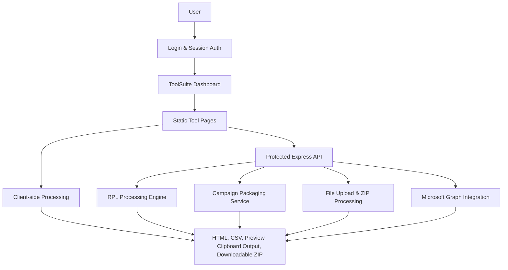
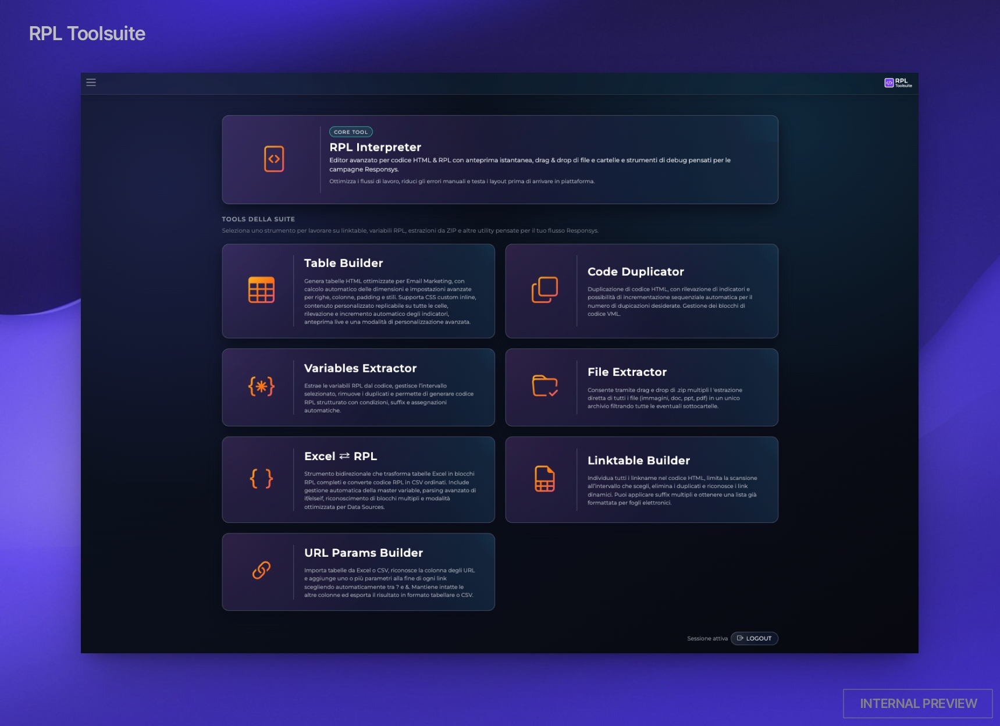
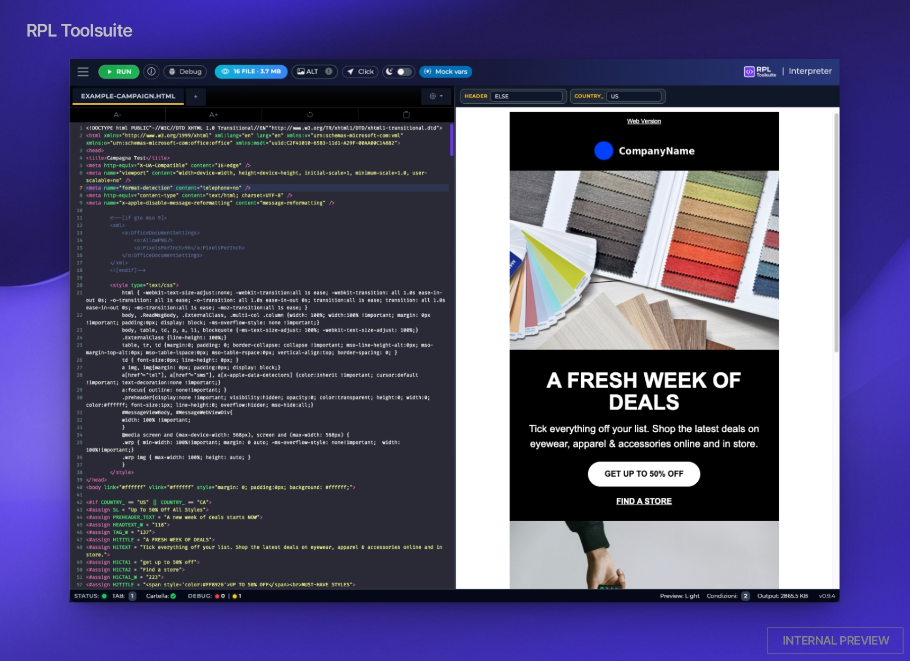

# RPL ToolSuite

> Internal platform designed to automate business workflows supporting Oracle Responsys campaign development.

---

## The Problem

Developing Oracle Responsys campaigns involved multiple repetitive manual tasks spread across different tools and workflows.

These activities required frequent copy/paste operations, manual data transformations, repetitive validations and extensive testing, increasing both development time and the risk of human error.

As campaign complexity grew, these repetitive operations became a significant bottleneck for the development team.

---

## The Solution

ToolSuite was designed to centralize and automate the most repetitive tasks involved in campaign development.

Instead of relying on multiple disconnected tools and manual operations, developers can perform complex workflows through a single interface, improving consistency, reducing manual effort and simplifying day-to-day activities.

The platform was designed with maintainability, usability and process standardization as primary goals.

---

## Key Features

- **Workflow Automation**
  Automates repetitive tasks involved in campaign development, reducing manual effort and improving consistency.

- **Campaign Asset Generation**
  Generates HTML snippets, campaign components and development assets through guided interfaces.

- **Visual Editing**
  Provides dedicated editors to simplify content creation, validation and testing.

- **Data Processing**
  Parses, transforms and validates campaign data, reducing manual manipulation.

- **File Packaging**
  Organizes and prepares campaign files into standardized structures ready for delivery.

- **Developer Productivity**
  Consolidates multiple utilities into a single platform, reducing context switching and improving development speed.

The platform currently includes **9 integrated tools**, each designed to solve a specific stage of the campaign development workflow.

---

## Technology Stack

### Backend

- Node.js
- Express.js
- REST APIs
- JWT Authentication

### Frontend

- HTML5
- CSS3
- JavaScript (ES6+)
- Bootstrap
- jQuery

### External Integrations

- Microsoft Graph API

### Security

- JWT Authentication
- Helmet
- CORS
- Rate Limiting

### Build & Tooling

- Git
- npm
- Custom Build System
- Code Minification
  
---

## Project Architecture

---

## Screenshots

### Dashboard

The ToolSuite dashboard provides a centralized access point to all available automation modules, allowing developers to quickly navigate through the different workflow utilities.

### RPL Interpreter

Advanced HTML & RPL editor featuring live preview, syntax highlighting and validation tools to simplify campaign development and testing.

---

## Results

The platform significantly reduced repetitive manual work during campaign development by centralizing multiple utilities into a single application.

### Achievements

- 9 integrated tools
- 30% estimated reduction in operational time
- Reduced manual effort and human error
- Improved workflow consistency
- Simplified testing and validation activities

---

## Why is the source code private?

ToolSuite was developed as an internal platform to support real production workflows and contains proprietary business logic, company-specific processes and implementation details that cannot be publicly disclosed.

This repository focuses on documenting the project's architecture, design decisions and capabilities while respecting confidentiality and intellectual property constraints.

The goal of this showcase is to demonstrate the overall software architecture, engineering approach and technical solutions behind the platform.
